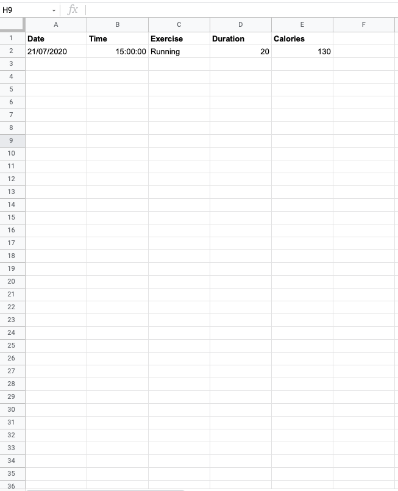
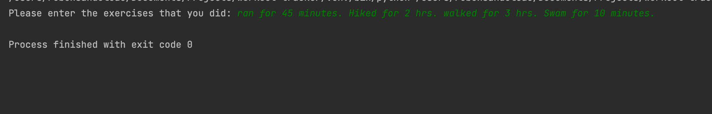
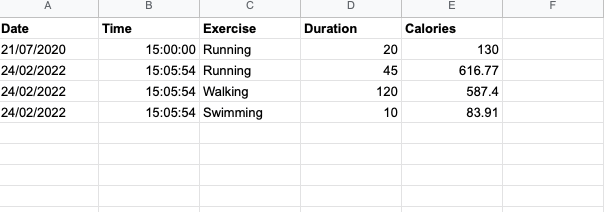

# Git Commit Tracker

Workout tracker using Nutritionix API capable of taking the user's input and parsing the sentence into correct data. 
The program takes an input such as "I ran for 5 miles" and generates the approximate duration based on fitness level,
and determines the caloric burn. Then, the Sheety API is used to connect a Google Sheets page where all the data such as 
Date, Time, Exercise, Duration and Calories are saved in their respective columns.

## Features

- Create an input for the user workout.
- implemented the POST
- Integrated Google Sheets with Nutritionix API
- Tracks Date, Time, Duration, Exercise, Calories

## Still needs to be implemented:
- Fully functional GUI
- Ability to add the input for caloric properties for Food
- Ability to POST, PUT, DELETE directly from the GUI
- Implement a way to see the Google Sheet in teh GUI
## Authors

- [@sanduler](https://github.com/sanduler)

### Built With

- [Python3](https://www.python.org/)

<p align="right">(<a href="#top">back to top</a>)</p>

<!-- GETTING STARTED -->

## Getting Started

This is an example of how you may give instructions on setting up your project locally.
To get a local copy up and running follow these simple example steps.

### Prerequisites

This is an example of how to list things you need to use the software and how to install them.

- npm
  ```sh
  npm install npm@latest -g
  ```

### Installation

1. Clone the repo
   ```sh
   git clone https://github.com/sanduler/workout-tracker
   ```
2. Install NPM packages
   ```sh
   npm install requests
   ```

<p align="right">(<a href="#top">back to top</a>)</p>


## Screenshots




--------------------------------

## License

[MIT](https://choosealicense.com/licenses/mit/)

